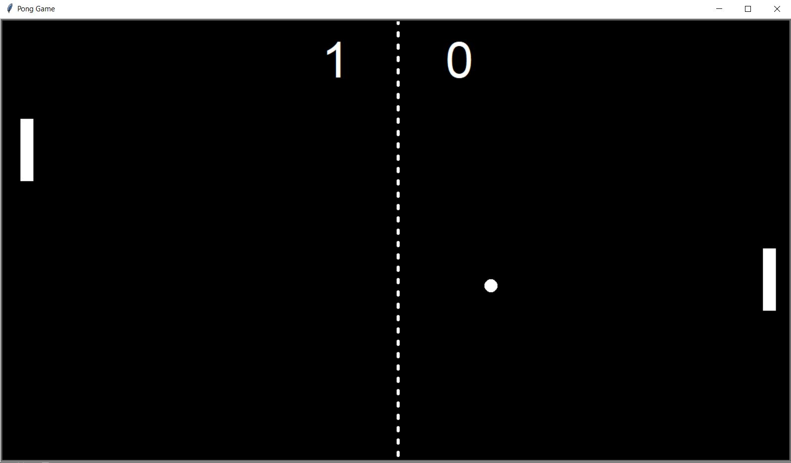

# Pong Game in Python (Two Player Mode)

This is a classic **Pong game** built using Python and the **Turtle graphics library**. The game features two paddles, a bouncing ball, and a scoreboard. Players control their paddles and try to score points by getting the ball past the opponent's paddle.

## Features:
- **Two Player Mode**: Control the left paddle using `W` and `S` keys and the right paddle using the `Up` and `Down` arrow keys.
- **Scoreboard**: Tracks the score for both players.
- **Ball Mechanics**: The ball bounces off the walls and paddles, and the speed increases slightly every time a player hits the ball.
- **Simple Graphics**: The game uses Turtle graphics to render the paddles, ball, and scoreboard.

## Files:

### `main.py`
This is the main file that runs the game. It initializes the screen, the paddles, the ball, and the scoreboard. It also sets up the game loop and handles user input for paddle movement.

### `ball.py`
This file defines the `Ball` class, which controls the movement of the ball, its reflection off the walls, and its interactions with the paddles. When the ball goes past a paddle, the score is updated, and the ball resets to the center.

### `scoreboard.py`
This file defines the `ScoreBoard` class, which handles the scoring system. It updates the score every time a player scores a point and displays the scores on the screen.

### `paddle.py`
This file defines the `Paddles` class, which creates and controls the paddles for both players. It allows the paddles to move up and down based on player input.

## How to Play:
1. Run `main.py`.
2. Use the **W** and **S** keys to control the left paddle.
3. Use the **Up** and **Down** arrow keys to control the right paddle.
4. The game ends when a player reaches a pre-set score (you can modify this in the code).
5. The ball speeds up after each bounce.

## Requirements:
- Python 3.x
- Turtle Graphics Library (comes pre-installed with Python)

## How to Run:
1. Make sure you have Python 3.x installed on your computer.
2. Download all the files.
3. Run `main.py` from your terminal or an IDE

   
Enjoy the game!

